# Aula 3 (Bônus)

## ES6 - EcmaScript 6 
* Nova versão do javascript
* EcmaScript - nome oficial do JavaScript
* ES6 é a versão de 2015 -> e assim se segue
* Existe um comitê que mantém a linguagem
* Os browsers devem se adaptar as novas adições
* Releases anuais
* Atualmente está na versão ES8 (2017)
* As grandes mudanças foram feitas no ES6

> **DICA** https://caniuse.com/#feat=es6-class mostra browsers que suportam tais funcionalidades

### Vantagem do JavaScript
* Fracamente tipado
* Sem herança
* Interpretado

## Variáveis

`const` uma constante
`let` variável que existe dentro do escopo em que foi criada
`var` variável global, tanto para a classe quanto para a aplicação

## Arrow Functions

* Não tem nomes
* São funções anônimas

**Forma padrão de criar uma função**
Perde-se o contexto: this se referencia a função não a classe
`function(<nome parametro> {lógica}`

O contexto não é perdido, this referencia a classe
`(<nome parâmetro>) => {<lógica>}`

## Operadores

	//Atribuição (nada de novo aqui)
	x = 1
	
	//Comparação de valor apenas
	x == 1 //true
	x == "1" //true
	
	//Comparação dos valores e tipos
	x === 1 //true
	x === "1" //false

## Array Functions
* Métodos de iteração `map, reduce, splice, find, findIndex, ...`
* Iteram num array
  `find(elemento => {elemento.sexo == 'M'})` retorna o primeiro
  `filter(elemento => {elemento.sexo == 'M'})` retorna um array com todos

`map((elemento, indice) => {elemento.index = indice})`

## Referencia a atributos de objeto

`objeto.atributo`
`objeto['atributo']`

## Outros conceitos
> Objetos e array são sempre copiados com referência

	a = {item: 1};
	b =a;
	b.item = 2 // a.item e b.item são 2

Se mudar um muda o outro

Para cópia sem referência use `Object.assign()` ou o `spread operator`

### Spread Opertor
`b = {...a}` equivale a `b = {item:1}`  faz uma cópia sem referência -> abre os valores de um objeto

# Testes no terminal

## Operadores de igualdade

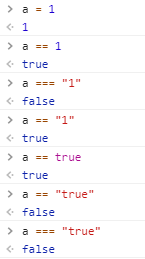

## Typeof

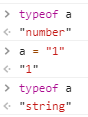

## Foreach

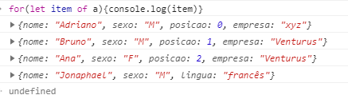

**Percorrendo chaves**

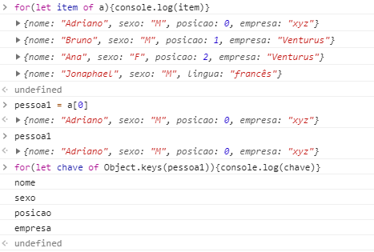

**Percorrendo valores**

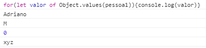

## hasOwnProperty

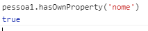

## Find

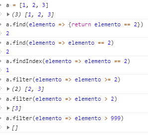

## FindIndex

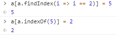

## Object Array

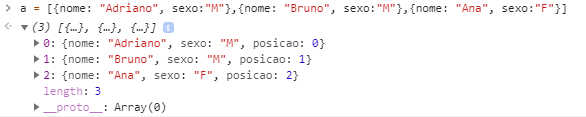

## Map

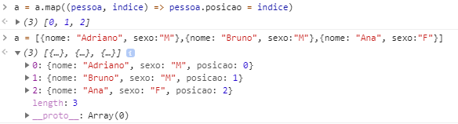

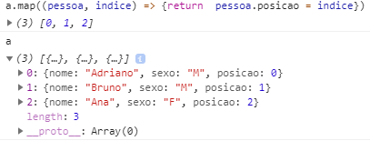

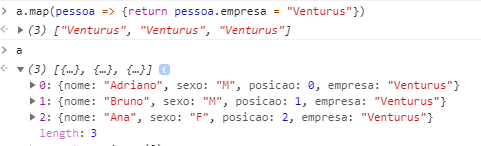

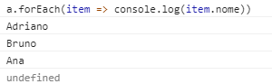

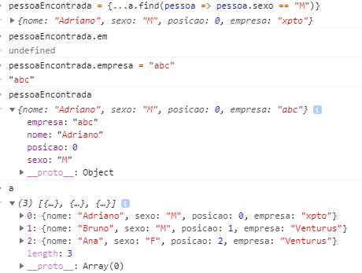

## Push

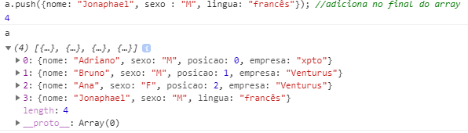

## Cópia

https://we-are.bookmyshow.com/understanding-deep-and-shallow-copy-in-javascript-13438bad941c?gi=2ca458d684e

### Spread Operator

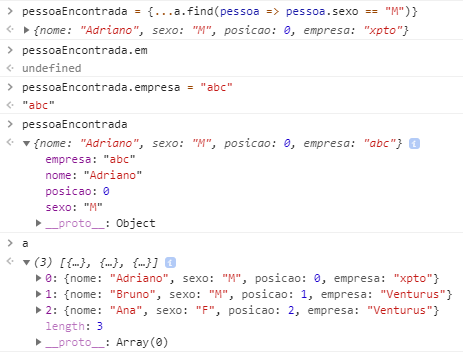

### Object Assign

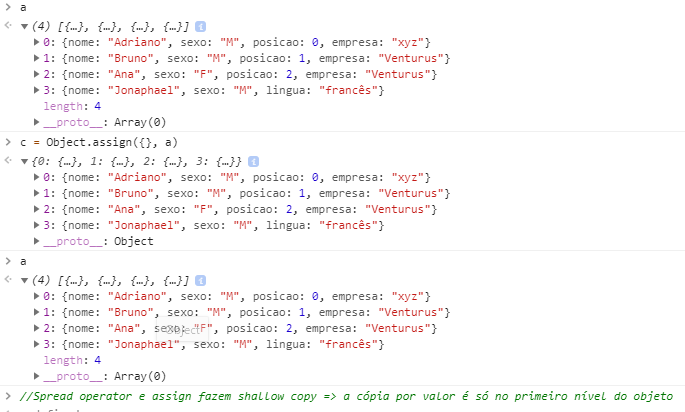

### Gambeta

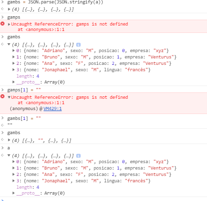

# Aula 3 - Firebase

* Fundado em 2011 e comprado pela Google em 2014
* Gratuito para aplicações pequenas
* Desenvolvimento web e mobile
* Ferramentas e recursos do google
* Não precisa se preocupar com escalabilidade
  * Se os requests aumentarem o hardware empregado aumenta automaticamente
* Não é só um banco de dados

## Firebase Database
### Firebase Realtime Database
* NoSql
* Tempo real
* Off-line
* Escalonável
* Mudando dados de um ponto todos os outros são atualizados

### Cloud Firestore
* Ainda está em beta
* Melhor performance
* Melhores consultas

## Authentication
* Autenticação por usuário e senha, telefone e entres federados (Google, Facebook, Twitter, GitHub, ...)
* FirebaseUI Auth : te dá o sdk e a iterface prontos 
* Autenticação anônima
* Tem um sdk

## Hosting
Hospedar o app em servidores do firebase
* Deploy no Firebase
* SSL - https
* Firebase CLI - client para desktop

## Storage
* Armazenamento de arquivos
* Upload e download segmentado
* Integrado com autenticação

## Cloud Functions
* Execução de códigos back-end
  * Triggers de database
  * Solicitações HTTPS
* Executa JS num ambiente Node.js

------

> Por padrão todos os serviços estão desativados!

