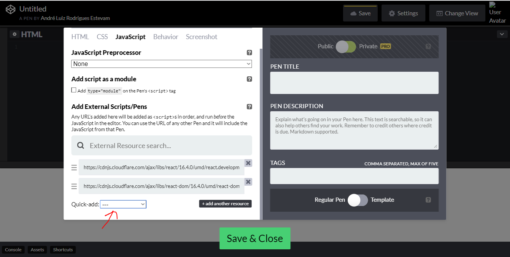

# Aula 4 - React

## Frameworks JS
* Conjunto de funções pré-definidas para facilitar o desenvolvimento
* Leve
* Alta performance
* Muita responsabilidade pro cliente
* Diminuir dados dos requests
* Facilitar a manipulação do DOM
* Comunidades ativas são importantes
* Ser open source também
* Permite a separação de responsabilidades entre as camadas: **negócio** e a **view**
  * Maior independência

## Library vs Framework
* **LIB**: Operações muito específicas e bem definidas
* **FRAMEWORK**: é um esqueleto, algo pré-feito

>  **Uglify** deixar o código sem espaços, sem enter e com nomes menores

## Sigle Page Application vs Multi Page Application

* **SEO** Search Engine Optimization
  * Coisas utilizadas no ranking do google, por exemplo
  * Ajude as *engines* de busca
  * **Multi Page Application**: melhores para SEO
  * **Single Page Application**: a engine de busca não sabe "usar" o site para ver tudo o que tem

* **Tamanho dos Requests**
  * **Single Page Application**: precisa trazer tudo de uma vez no primeiro request
    * Primeiro request mais pesado
    * Depois do primeiro request o tamanho dos próximos diminui
  * **Multi Page Application** : carrega a página toda mas não precisa baixar tudo
    * Cada request pega apenas o que precisa para mostrar a página

* **Reuso**
  * **Single Page Application**: facilita pois posso modularizar
  * **Multi Page Application**: dificuldade de modularizar

* **Performance**
* * **Single Page Application**: mais rápido
  * **Multi Page Application**:  mais lento

**SPA**

* Melhor experiência de usuário
* Performance
* Interação no client side
* Preciso usar um framework

## Escolha do Framework

* **QUEM USA?**
  * Angular: google
  * React: facebook
  * Vue: nenhuma...

* **COMUNIDATE ATIVA?**
  * Perguntas e RESPOSTAS no StackOverflow

* **COMO É O GITHUB DO FRAMWEORK?**
* **NOVAS VERSÕES SÃO FREQUENTES?**
* **QUAL A CURVA DE APRENDIZADO?**

# React.js
* Criado em 2011 pelo Facebook
* Base para fazer SPAs
* Lemas:
  * Declarativo
  * Baseado em componentes
  * Aprenda uma vez, escreva em qualquer lugar

## Funcionalidades
* Baseado em componentes
* Virtual DOM
  * Cópia do dom na memória
* Onde-way data binding com props
* Controle do ciclo de vida dos componentes
  * Para cada componente posso ter métodos quando ele é criado, coisas acontecem com ele, quando é removido, ...

## codepen.io
* https://codepen.io
* Facilita a criação de páginas web de forma rápida

**Importando react**

> JSX: uma forma de colocar html no arquivo js

**Hello World com React**

> JSX:  return deve retornar apenas um objeto

## JSX

* É transpilado (pelo babbel)

>  **Compilado**: binário

>  **Transpilado**: fazer mudanças para colocar o código em uma outra linguagem

* `class` é uma palavra reservada, use `className`
* `style={{background-color: 'red', color: 'blue'}}` estilo CSS inline com notação javascript

* No JSX todas as tags precisam ser fechadas